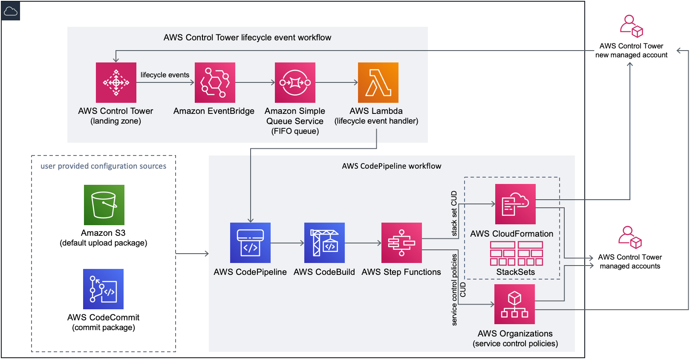

# AWS CfCT 를 통한 PermissionSets, SCP, Config 관리 - GitOps 방식의 인프라 운영
**Customizations for AWS Control Tower(CfCT)** 는 AWS Control Tower와 여러 서비스를 결합하여, 멀티 계정 환경에 조직 맞춤형 리소스를 자동으로 배포할 수 있도록 지원하는 솔루션입니다.
이 프로젝트는 **AWS Control Tower**와 **CfCT(Customizations for AWS Control Tower)** 를 활용하여 조직의 **IAM Role**, **PermissionSet**, **SCP**, **AWS Config Rule** 등을 GitOps 방식으로 자동 배포하는 구조입니다.

## 목차
- [프로젝트 목적](#프로젝트-목적)
- [아키텍처](#아키텍처)
- [프로젝트 구조](#프로젝트-구조)
- [배포 방법](#배포-방법)
- [주의 사항](#주의-사항)

## 프로젝트 목적
- AWS Control Tower 기반 멀티 계정 환경에 조직 표준 리소스 자동 배포
- 계정 생성 시점에 자동 트리거되는 IaC 기반 구성
- GitHub → CodePipeline → SCP/RCP or StackSet → 계정 구조로 GitOps 운영
- 보안, 운영, 감사 정책을 코드로 통제 (SCP, Config, IAM, SSO 등)

## 아키텍처


## 프로젝트 구조
```tree
.
├── manifest.yaml                                                    # CfCT 메인 매니페스트 파일
├── config/
│   └── rule-accesskeys-rotated.template                             # Config 룰 템플릿
├── iam/
│   └── role-ec2-describe.template                                   # EC2 조회 전용 IAM Role
├── permissionsets/
│   ├── permissionset-ec2-describe.template                          # Permission Set 정의
│   ├── permissionset-ec2-describe-assignment-012345678901.template  # Permission Set 할당
│   └── policy-ec2-describe.template                                 # 커스텀 IAM Policy 정의
└── scp/
    └── preventive-controls.json                                     # 위험 작업 방지 SCP 정책
```

## 배포 방법

### 1. CfCT CloudFormation 배포
AWS 콘솔에서 Control Tower **관리 계정**에 로그인한 뒤, 아래 절차를 따라 CfCT를 배포합니다.

1. 아래 템플릿을 사용해 CloudFormation Stack 배포  
- Github에 업로드한 `customizations-for-aws-control-tower.template` 파일을 통해 진행하거나 aws-solutions Github에서 각 릴리즈를 다운
- **[사용 템플릿 링크 (v2.8.1 사용 25년 7월 기준)](https://github.com/aws-solutions/aws-control-tower-customizations/releases/tag/v2.8.1)**

2. 다음과 같은 파라미터를 입력합니다:

| Configuration Parameter     | Default 값                          | 설명                                              |
| --------------------------- | ---------------------------------- | ----------------------------------------------- |
| ARN of the Code Connection  |                                    | 코드 연결에 사용할 리소스 ARN                              |
| GitHub User or Organization | git-username                       | GitHub 저장소를 소유한 사용자                             |
| GitHub Repository Name      | custom-control-tower-configuration | Custom Control Tower 구성이 포함된 GitHub 저장소의 이름     |
| GitHub Branch Name          | main                               | Custom Control Tower 구성이 포함된 GitHub 저장소의 브랜치 이름 |

GitHub 기반 배포를 위해 [CodeStar Connection 생성](https://docs.aws.amazon.com/ko_kr/controltower/latest/userguide/cfct-github-configuration-source.html)이 먼저 필요합니다.

### 2. `manifest.yaml` 설정 예시
```yaml
resources:
  - name: cfct-ec2-describe-permission-set
    resource_file: permissionsets/permissionset-ec2-describe.template
    parameters:
      - parameter_key: InstanceArn
        parameter_value: "<your-sso-instance-arn>"
      - parameter_key: TargetUser
        parameter_value: "<user-id>"
      - parameter_key: TargetAccountId
        parameter_value: "<target-account-id>"
    deploy_method: stack_set
    deployment_targets:
      accounts:
        - "<your-account-id>"
    regions:
      - ap-northeast-2
```

### 3. 사용 방법
```bash
git clone https://github.com/Shin9184/CfCT

# manifest 파일 수정 필요!!
vi manifest.yaml

git add .
git commit -m "add your commit messages"
git push
```

## 주의 사항

#### 1. 템플릿 배포 실패 시 버전 확인
- 25년 7월 기준 AWS에서 제공하는 최신 CfCT CloudFormation 템플릿(v2.8.2 기준)에서 배포 오류 발생
- 이전 버전(v2.8.1)을 사용할 경우 정상적으로 배포됨
- [릴리즈 확인](https://github.com/aws-solutions/aws-control-tower-customizations/releases)

#### 2. Master 계정에 배포하려면 IAM Role 필요
- `AWSControlTowerExecution` 이라는 이름의 IAM Role이 필요하며, CodePipeline 실행 시 사용
- 기본 권한은 `AdministratorAccess`, 신뢰 정책은 아래와 같음
- Master 계정에 해당하는 Role이 없으면 StackSet 배포 시 AccessDenied 오류가 발생

```json
# Trust Relationship
{
  "Version": "2012-10-17",
  "Statement": [
    {
      "Effect": "Allow",
      "Principal": {
        "Service": "cloudformation.amazonaws.com"
      },
      "Action": "sts:AssumeRole"
    }
  ]
}
```

#### 3. CloudFormation 리소스 Logical ID 네이밍 규칙
Resources 내부 Logical ID에는 하이픈(-)이나 언더스코어(_) 사용 불가

예시:

가능 : PermissionsetEc2Describe

불가능 : Permissionset-EC2-Describe or Permissionset_ec2_describe

하지만 Name, PolicyName 등 속성 값에는 하이픈/언더스코어 사용 가능

#### 4. Stack 간 종속 관계 처리 방법
PermissionSet과 Assignment을 별도 템플릿으로 나눌 경우 Outputs + Export → !ImportValue 방식 사용

예시:

```yaml
# permissionset-ec2-describe.template

Outputs:
  PermissionSetArn:
    Value: !GetAtt PermissionsetEc2Describe.PermissionSetArn
    Export: # PermissionSet Stack에서 Export 정의
      Name: PermissionSetArn
permissionset-ec2-describe-assignment.template
```

```yaml
# permissionset-ec2-describe-assignment-012345678901.template

PermissionSetArn: !ImportValue PermissionSetArn # Assignment Stack에서 ImportValue 사용
```
manifest.yaml에서는 동적으로 값을 받아서 다른 template 파일로 전달이 불가하여, 각 템플릿 파일에서 Export/Import 방식이 필요합니다.

#### 5. PermissionSet + Assignment을 하나의 템플릿으로 구성할 경우
- 가능한 구조이지만 여러 계정에 배포할 경우, 파라미터를 사용하지 못하고 `parameter_value`를 리스트 형태나 다르게 줄 수 없음
- 파라미터 재사용이 어려워 가독성과 유지보수가 떨어짐
- 복잡한 환경일수록 템플릿을 분리하고 ImportValue로 연결하는 구조 권장

#### 6. IAM Identity Center 사용자 생성 불가 (CloudFormation 미지원)
현재 CloudFormation에서는 AWS::IdentityStore::User 리소스를 지원하지 않음
따라서 `TargetUser ID`는 수동으로 생성 후 manifest.yaml에 직접 입력해야 함
[CloudFormation IdentityStore 리소스 참조](https://docs.aws.amazon.com/ko_kr/AWSCloudFormation/latest/TemplateReference/AWS_IdentityStore.html)

#### 7. GitHub 연동 시 CodeStar Connections 설정 필요
CfCT 배포 시 GitHub 소스를 사용하려면 AWS의 CodeStar Connection 설정이 선행되어야 함
연결 후 CloudFormation 파라미터에서 ConnectionArn 값을 정확히 입력해야 함